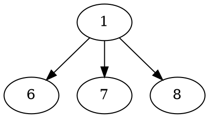
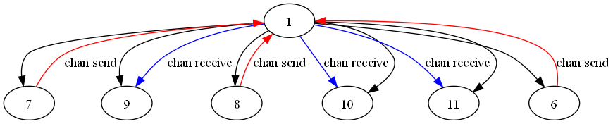

## 可視化ツール
- goroutineの親子関係を可視化するツール
- `dotファイル`として出力されるので`grahviz`を用いて画像に変換する

## Environment
- go1.21rc2
- graphviz-8.0.5

## Implementation
```bash
$ go run main.go
```
## Result

```dot
digraph G {
"1" -> "6";
"1" -> "7";
"1" -> "8";
}
```
.dot -> png
