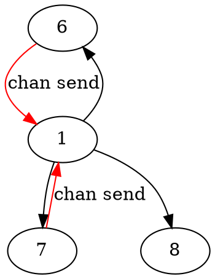

## 可視化ツール
- https://zenn.dev/keisuke114/scraps/2601779b90d9be
- goroutineの親子関係を可視化するツール
- `dotファイル`として出力されるので`grahviz`を用いて画像に変換する

## Environment
- go1.21rc2
- graphviz-8.0.5

## Implementation
```bash
$ go run main.go
```
```bash
$ dot -Tpng goroutines.dot -o goroutines.png
```

## Result

.dot -> png
